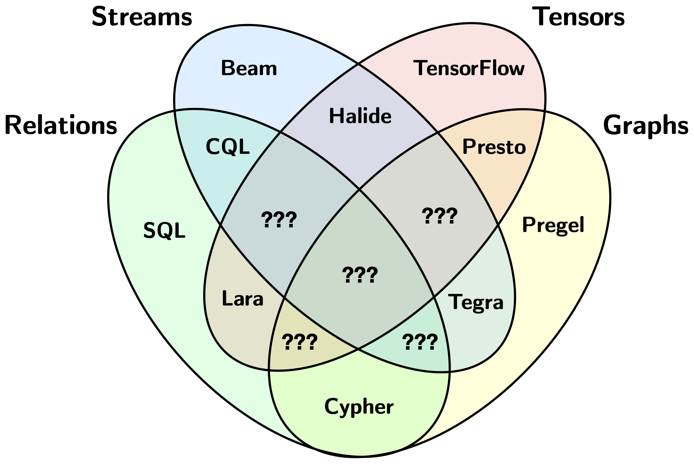

# Problem and Motivation

The vision of Arc-Script is a language with support for processing multiple types of collections. This is in contrast to most distributed systems languages and frameworks for data analytics which only support a limited number of collection types.

Arc-Script's level of abstraction is lower than query-languages but higher than systems languages. Programs contain sequential (non-declarative) code, have pass-by-value semantics, and compile into and intermix with systems languages and streaming runtimes. Arc-Script's generality level is broader than query-languages but narrower than general-purpose languages. Like query-languages, Arc-Script programs are about programming with high-level operators and collections, but unlike query-languages, these concepts can also be naturally expressed inside Arc-Script programs. The idea is to give more flexibility and allow programs to be optimised at a finer level of granularity, while removing potential complexity introduced by systems languages. Since there are benefits to lifting the level of abstraction even further, we will eventually build a higher level which compiles into Arc-Script.
